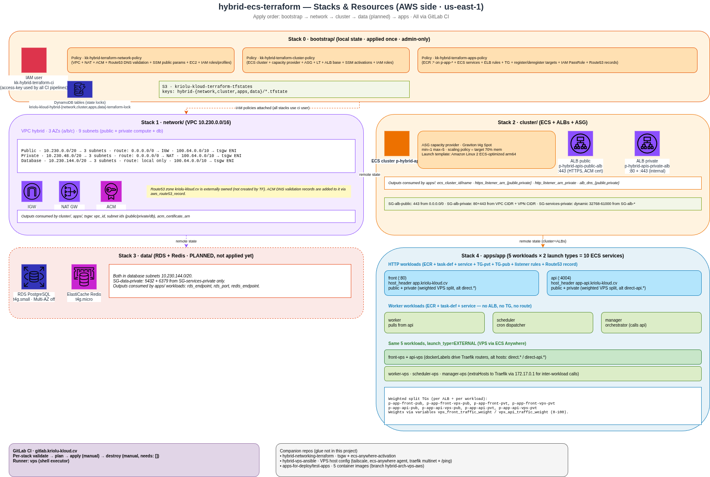

# hybrid-ecs-terraform



Terraform for the **Kriolu Kloud hybrid VPS↔AWS architecture** — a single ECS cluster (`p-hybrid-apis`) that runs container instances of two launch types simultaneously:

- **EC2 (AWS side)** — Graviton `t4g` Spot autoscaling group in the hybrid VPC
- **EXTERNAL (VPS side)** — Contabo VPS registered via ECS Anywhere, tasks discovered by Traefik through Docker labels

Traffic is shared across both sides via **weighted forward** on the ALB target groups (default 80% AWS / 20% VPS; flipping to 100% VPS is a one-variable change).

📊 See `infrastructure-overview.drawio` (this repo root) and `../../networking/hybrid architecture/hybrid-architecture-overview.drawio` for the full picture.

---

## Stacks (Terraform)

Applied in this order — each has its own state key + DynamoDB lock:

| # | Stack | What it creates |
|---|---|---|
| 0 | `bootstrap/` | DynamoDB locks + IAM CI user `kk-hybrid-terraform-ci` + 3 scoped policies (network / cluster / apps). **Local state, applied once, admin-only.** |
| 1 | `network/` | VPC `10.230.0.0/16`, subnets (public/private/DB), IGW, NAT, ACM wildcard `*.kriolu-kloud.cv`, DNS-validation records |
| 2 | `cluster/` | ECS cluster `p-hybrid-apis`, public + private ALBs, Graviton `t4g` Spot ASG capacity provider |
| 3 | `data/` | RDS PostgreSQL `t4g.small` + ElastiCache Redis `t4g.micro` (**not applied yet — pending**) |
| 4 | `apps/` | 5 ECS workloads × 2 launch types (10 services total) + Route53 records + weighted VPS TGs + Traefik dockerLabels |

## Companion repositories

Anything AWS↔VPS glue or VPS host config lives elsewhere:

| Concern | Repo |
|---|---|
| Tailscale subnet router EC2 + VPC routes 100.64.0.0/10 | [`hybrid-networking-terraform/tailscale-gw/`](../../networking/hybrid%20architecture/hybrid-networking-terraform/) |
| ECS Anywhere SSM activation | [`hybrid-networking-terraform/ecs-anywhere-activation/`](../../networking/hybrid%20architecture/hybrid-networking-terraform/) |
| VPS host config (Tailscale join, ECS Anywhere agent, Traefik bridge attach, Traefik `/ping`) | [`hybrid-vps-ansible/`](../../networking/hybrid%20architecture/hybrid-vps-ansible/) |
| Container images (test-apps) | `../../../apps-for-deploy/test-apps/app/` (5 repos: api, front, worker, scheduler, manager) |

## CI/CD (GitLab)

Every stack has validate → plan → apply → destroy pipelines gated by manual approval + `environment: hybrid-prod`. Root CI at `.gitlab-ci.yml` includes each stack's per-folder CI.

- **Runner:** self-hosted `vps` (shell executor on the Contabo VPS)
- **Auth:** AWS keys of `kk-hybrid-terraform-ci` as protected CI vars
- **Destroy stage:** `needs: []` — decoupled from apply, can run without triggering apply first

Trigger a pipeline: push to `main`, GitLab launches validate + plan; approve `apply` when ready.

## Weighted VPS ↔ AWS split

`apps/app/workloads_vps.tf` defines two TGs per HTTP workload (front, api), one per ALB (`-pub`, `-pvt`), all pointing at the same Tailscale IP `100.73.87.120:80`. The workload module wires them into 6 listener rules:

```
Public 443:  Host(app.*)     → forward [AWS-TG w=80, VPS-TG-pub w=20]
Public 443:  Host(app-api.*) → forward [AWS-TG w=80, VPS-TG-pub w=20]
Private 443: same rules, VPS-TG-pvt (separate TG — AWS rejects one TG on multiple LBs)
Private 80:  same rules, VPS-TG-pvt
```

Change weights via `vps_front_traffic_weight` + `vps_api_traffic_weight` (default 20). `100` = full VPS cutover, `0` = AWS-only.

**Full VPS bypass:** `direct.kriolu-kloud.cv` + `direct-api.kriolu-kloud.cv` A records point straight to the VPS public IP (`161.97.83.115`), skipping the AWS ALB entirely. Traefik router accepts both the AWS-fronted hostname and the direct one (`alt_host_headers` variable). Let's Encrypt cert auto-emits on first HTTPS request via HTTP challenge.

## Hard-won gotchas

- **ECS `load_balancer` was in `ignore_changes`** — silently blocked TF from attaching a new TG (public listener rule created but TG had no targets → 503). Removed; CI redeploy only touches task_definition anyway.
- **`container_definitions` in `ignore_changes` on VPS task defs** — silently blocked Traefik label updates. Removed; CI uses `--force-new-deployment` on `:latest`, doesn't create new task-def revs.
- **`aws_lb_target_group` rejects same TG on multiple ALBs** (`TargetGroupAssociationLimit`) — hence the per-ALB duplication with `for_each`.
- **`aws ecs update-service --force-new-deployment`** keeps the current task-def rev — pass `--task-definition <family>` (no `:rev`) to pick up LATEST.
- **ECS Anywhere agent doesn't clean up containers** when service is dropped or task-def bumped. Zombies cause Traefik "Router defined multiple times". Manual: `docker container prune -f` or targeted `docker rm -f`.
- **ECS cluster destroy hangs** if container instances still registered — `ansible destroy.yaml` should deregister first; if not, do it via AWS CLI (`deregister-container-instance --force`).

## Isolation from `cluster-ecs-terraform`

Same S3 state bucket, disjoint keys + own DynamoDB locks so this project can iterate without risk to the older prod deployment:

| Item | `cluster-ecs-terraform` | `hybrid-ecs-terraform` |
|---|---|---|
| VPC CIDR | 10.220.0.0/16 | **10.230.0.0/16** |
| State prefix | `network/cluster/apps-terraform/` | `hybrid-{network,cluster,apps,data}/` |
| Cluster | `p-ecs-cluster-main` | `p-hybrid-apis` |
| CI user | `kk-terraform-ci` | `kk-hybrid-terraform-ci` |

## Local usage (rare)

Terraform via Docker (image `hashicorp/terraform:1.9`). Only used for bootstrap or emergency recovery — production changes go through CI.

```bash
cd <stack>/environments/prod
docker run --rm --user "$(id -u):$(id -g)" \
  -v "$(realpath ../..):/w" -w /w/environments/prod \
  -e AWS_ACCESS_KEY_ID -e AWS_SECRET_ACCESS_KEY -e AWS_DEFAULT_REGION \
  hashicorp/terraform:1.9 <command>
```

## Status

**Live via CI.** Cutover tested (100% VPS + rollback), destroy tested (full teardown minus bootstrap in ~15 min). Data stack (`data/`) still pending — deploys unblocked but not applied.

## Origin

Forked 2026-09-04 from `cluster-ecs-terraform`. Design decisions live in `.claude/topicos/hybrid-architecture/CONTEXTO.md` (H1–H9).
